# Swintt Test Victor Pacheco

## Task
You are challenged to do a simple To-Do app, using Node.JS (using Typescript would be a bonus), where a user logs in, can post a note, can get/view his notes, and can delete them, etc. No frontend is required (that would be a bonus too). The idea is to use this app using Postman.

## Backend

### Infrastructure
I decided to use an AWS Lambda function to perform the CRUD operations for the notes. For the database, I used DynamoDB. For user management, I utilized Cognito and configured a Cognito User Pool to allow users to create accounts with their email addresses and authenticate with their Google accounts using the OAuth2 protocol. I used an API Gateway with integration to the Lambda function and an authorizer to validate user tokens.

### Code
I used AWS CloudFormation to provision the necessary infrastructure (except for the Cognito User Pool). The CloudFormation template is located in the file [template.yml](swintt-test-victor-pacheco-backend/template.yml)

I created a [deploy.sh](swintt-test-victor-pacheco-backend/deploy.sh) script to automate the deployment of the Lambda function and all infrastructure. This script works only on macOS and Linux operating systems, but it requires the following CLI tools to be installed and configured for proper functioning: `npm`, `aws`, and `sam`.

The structure of the code is as follows:

```markdown
lambda-function
├── src
│ ├── app.ts
│ ├── CustomExceptions.ts
│ ├── NoteController.ts
│ └── NoteService.ts
├── package.json
└── tsconfig.json
```

- **src/**: This folder contains the source TypeScript files.
    - `app.ts` contains de lambda handler function
    - `CustomExceptions.ts` contains custom exceptions
    - `NoteController.ts` contains the http flow
    - `NoteService.ts` contains the business logic

- **package.json**: file with project dependencies
- **tsconfig.json**: file with TypeScript configuration


### Deploy

The backend is currently deployed at the following URL: `https://i2vqsr9bwd.execute-api.eu-west-1.amazonaws.com/v1/notes`. However, **you will need an access token to authenticate**. In the [last Frontend section](#get-access-token), we will explain how you can obtain an access token.

### Postman Collection

I created a Postman collection to test the various methods of the REST API. You can access the Postman collection [here](docs/Notes.postman_collection.json).

To use the collection, you will need to place your access token in the `token` variable located in the Pre-request Script of the collection, as follows:

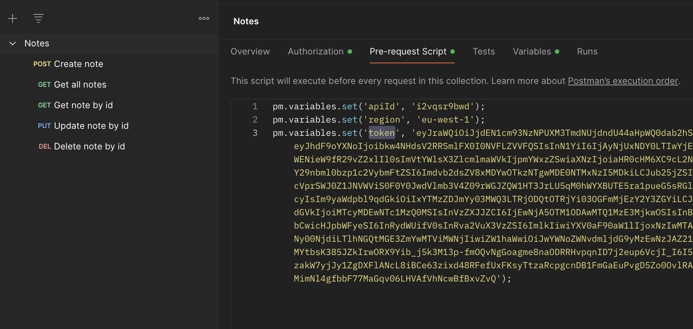

I created several tests for each method. You can run the tests by selecting the `Run Collection` option:

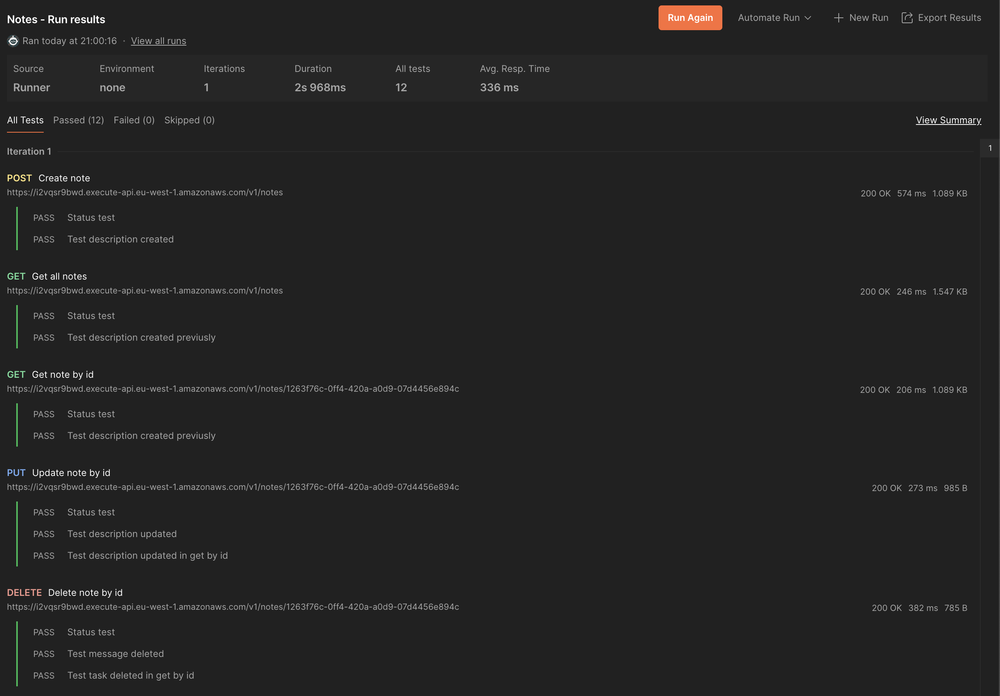


## Frontend

### Infrastructure

I have hosted the frontend application in an S3 bucket as a static website and created a CloudFront distribution (CDN) associated with that bucket to access the application via `https`. This setup enables the use of Google sign-in and account creation functionalities.

The CloudFront distribution URL is:

- [https://dfdu9q1px04yi.cloudfront.net/](https://dfdu9q1px04yi.cloudfront.net/)

Through this link, you will be able to access all the functionalities of the application.

### Code

The frontend is a standard Angular v16 application. Its main features are:
- Use of `Guards` to allow access only to logged-in users.
- Use of `aws-amplify` to handle logins and requests to the backend (with the Authorization header).
- Google sign up and sign in
- Email verification and password recovery (for users who created an account without Google)

### Screenshots

Below are some screenshots of the application's functionalities:

- Here you can sign in with your email and password (previously created) or with your Google account.
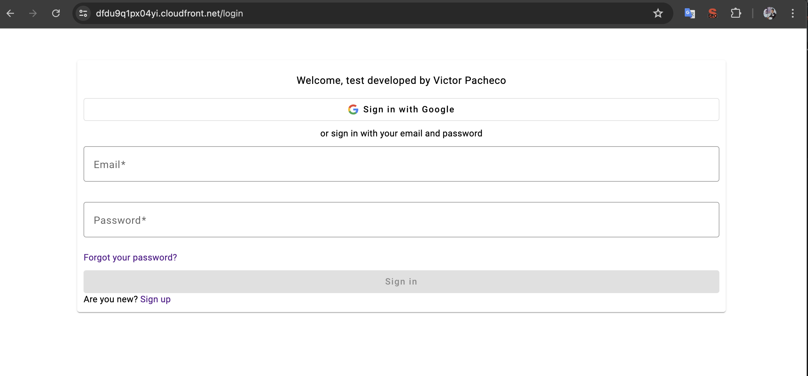
  

- If you decide to sign in with your Google account, this is what you will see:
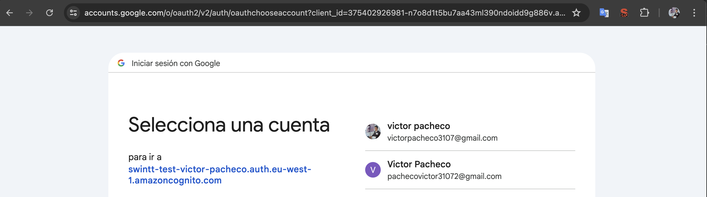


- When you sign in you will see the list of your notes:
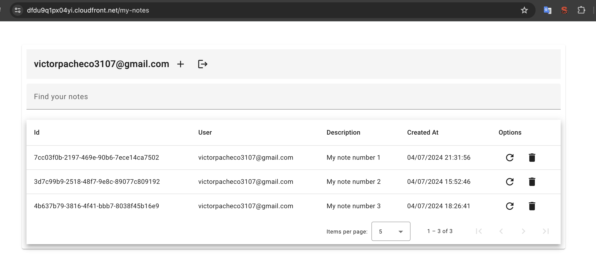  


- This happens when you delete a note:
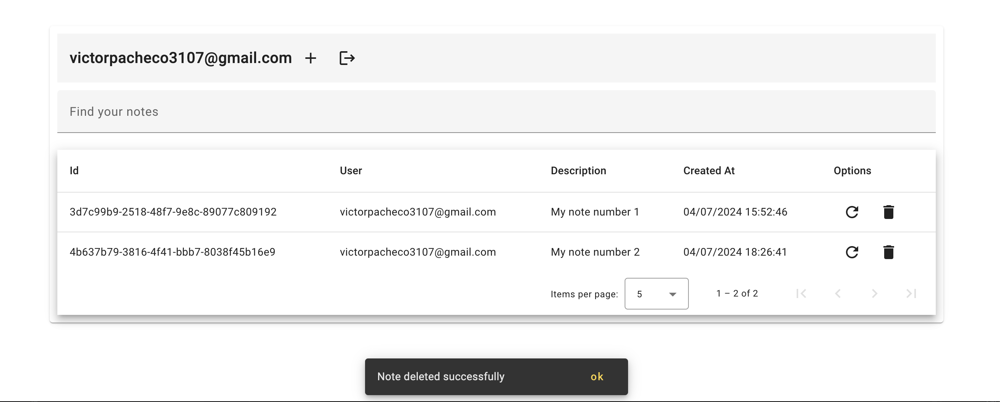


- We are creating a note:
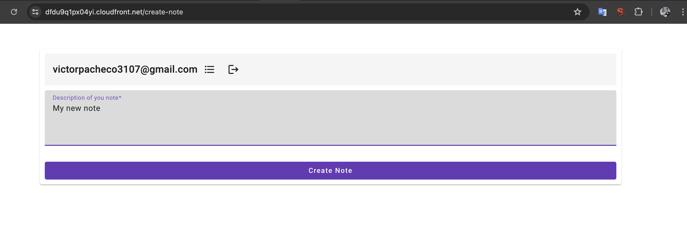


- And this is the confirmation of the creation of the note:
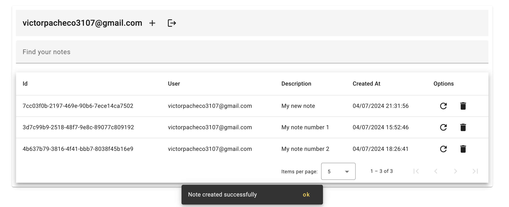


- Editing a note:
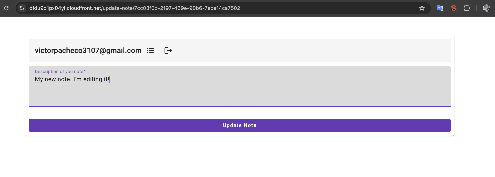


- And this is the confirmation of the editing of the note:
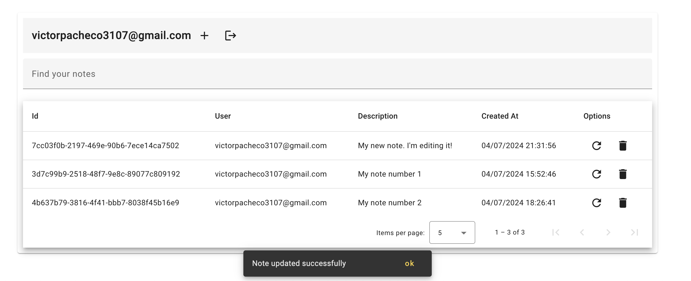


### <a name="get-access-token"></a> Get Access Token

If you want to get an access token to use in postman, you can enter the link https://dfdu9q1px04yi.cloudfront.net/my-notes and in the browser console you will see an access token:
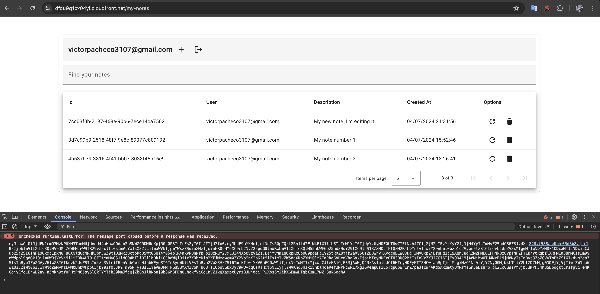
